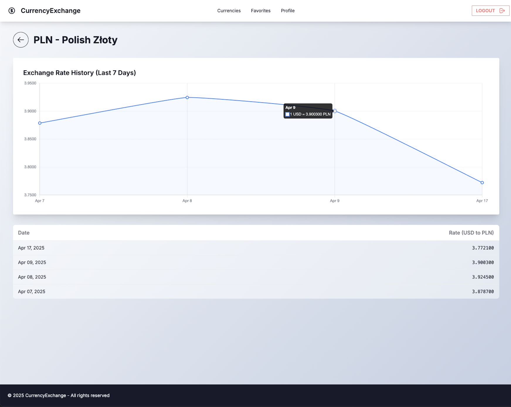

# Currency Exchange 💹


A modern web application for tracking currency exchange rates with historical data visualization, user authentication, and favorites management.

<div style="display: flex; gap: 10px; flex-wrap: wrap;">
  
  
</div>

## Features

- **Real-time Currency Rates**: Fetched from external API
- **Historical Data**: 7-day exchange rate charts
- **User Accounts**: Secure registration and authentication
- **Favorites System**: Save preferred currencies
- **Automated Updates**: Daily rate fetching via Celery
- **Responsive Design**
- **Clean UI**: Built with TailwindCSS and DaisyUI

## Tech Stack

| Category       | Technologies                                                                 |
|----------------|------------------------------------------------------------------------------|
| Backend        | Django, Python, PostgreSQL                                                  |
| Frontend       | HTML, TailwindCSS, DaisyUI, Chart.js                                        |
| Infrastructure | Docker, Docker Compose                                                      |
| Async Tasks    | Celery, Redis                                                               |
| Code Quality   | Flake8, Pre-commit hooks                                                    |

### Prerequisites

- Docker and Docker Compose
- Python 3.11+
- API key from [ExchangeRate API](https://exchangerate-api.com/)

### Installation

1. Clone the repository:
   ```bash
   git clone https://github.com/yourusername/currency-exchange.git
   cd currency-exchange
   ```
   
2. Create .env file
   ```bash
   cp .env.example .env
   ```
Replace the `EXCHANGE_RATE_API_KEY` value in `.env` with your actual API key.

3. Build and run the Docker containers:
   ```bash
   docker-compose up --build
   ```
   
4. Launch the application:
   - Open your browser and navigate to `http://localhost:8000`

## API Endpoints

| Endpoint              | Description                        |
|-----------------------|------------------------------------|
| `/api/rates/median/`  | Get median rates for last 30 days |